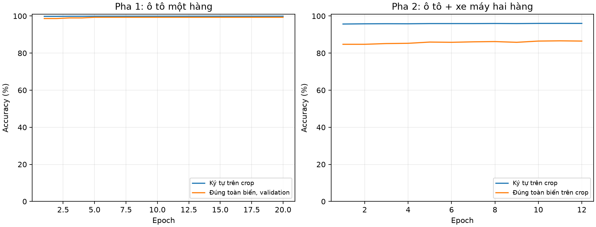

# Trình bày tiến độ: LeNet-5 biển một hàng và hai hàng

Chạy trực tiếp bằng cấu hình Run and Debug của VS Code. Bắt đầu: **2026-09-27 21:36:23 SE Asia Standard Time**; kết thúc: **2026-09-27 21:45:13 SE Asia Standard Time**. Mô hình có 30 lớp ký tự, Conv1=6 kênh, Conv2=16 kênh; không pruning.

## Quy trình đã chạy

1. Lấy 1.000 biển ô tô một hàng từ bộ đã lọc, crop ROI và ký tự 32×32.
   Tập một hàng train/validation/test của lần chạy này đều là biển 8 ký tự; không suy rộng số này cho biển ô tô 9 hoặc 10 ký tự.
2. Train LeNet-5 dense bằng weighted cross-entropy, confusion cost, hard mining 25%, augmentation; chọn checkpoint theo validation.
3. Khi validation ký tự và toàn biển trên crop đều ≥95%, fine-tune trên ô tô và xe máy hai hàng; giữ Conv1 cố định, Conv2 vẫn đủ 16 kênh.
4. Đánh giá riêng OCR trên crop tham chiếu và pipeline tự phân đoạn; bỏ qua được tính là sai trong exact toàn biển.

## Kết quả đo được

| Tập / điều kiện | Accuracy ký tự | Exact toàn biển | Mẫu biển |
|---|---:|---:|---:|
| Một hàng, validation crop tham chiếu | 99.92% | 99.33% | 300 |
| Một hàng, validation tự phân đoạn ROI | N/A | 99.33% | 300 |
| Một hàng, test crop tham chiếu | Không đo được (thiếu crop tham chiếu) | Không đo được (thiếu crop tham chiếu) | 500 |
| Một hàng, test tự phân đoạn ROI | N/A | 0.00% (0/500) | 500 |
| Hai hàng, test crop tham chiếu | 96.48% (5914/6130) | 85.24% (647/759) | 759 |
| Hai hàng, test tự phân đoạn từ ROI | 96.86% khi đếm đúng | 29.00% (603/2079) | 2079 |

Fine-tune hai hàng tăng accuracy ký tự trên crop test từ 95.56% lên 96.48%; exact crop từ 82.61% lên 85.24%. Exact tự phân đoạn từ ROI tăng từ 28.09% lên 29.00%.

| Hai hàng theo xe | Accuracy ký tự crop | Exact crop | Exact tự phân đoạn từ ROI |
|---|---:|---:|---:|
| Ô tô | 97.25% | 88.98% | 34.42% (497/1444) |
| Xe máy | 94.05% | 72.19% | 16.69% (106/635) |

## Phân tích lỗi và giới hạn

Tập một hàng test có crop tham chiếu hợp lệ cho 0/500 biển; pipeline tự phân đoạn có output ở 338/500 biển, nhưng chỉ đúng trọn 0. Do đó không được diễn giải exact test bằng 0 thành accuracy của riêng CNN bằng 0.
Trong evaluator một hàng hiện tại, `plate_crop` đã chuẩn bị lại được đưa qua `perspective_correct` thêm một lần trước khi phân đoạn. Đây là lỗi quy trình có khả năng làm giảm mạnh kết quả test; phải sửa và đo lại trên cùng split trước khi dùng số 0/500 để đánh giá phiên bản triển khai thực tế.

Trong 2079 ảnh test hai hàng, chỉ 1155 ảnh có output hợp lệ; 924 ảnh không có output. Ngoài ra 452 output có số ký tự không khớp nhãn. Nút thắt hiện tại chủ yếu nằm ở tìm/tách ký tự và phân loại hàng.
Số crop huấn luyện hai hàng: 40,681 từ 5,034 biển; đủ 30/30 lớp nhưng tỉ số lớp nhiều/ít nhất là 201.5:1. Cần thêm mẫu lớp hiếm trước khi kết luận mọi ký tự đều chính xác như nhau.

Các cặp nhầm lẫn nhiều nhất trên test crop tham chiếu:

| Ký tự thật | Dự đoán | Lần |
|---|---|---:|
| 6 | 3 | 10 |
| 4 | 3 | 8 |
| 1 | 3 | 6 |
| Z | 2 | 5 |
| A | 6 | 5 |
| A | 3 | 5 |
| 7 | 1 | 5 |
| 4 | A | 5 |

Validation một hàng dùng crop tham chiếu và đã vượt ngưỡng, nhưng test một hàng chưa đạt điều kiện tự phân đoạn. Chỉ số hai hàng trên crop tham chiếu cũng dùng độ dài nhãn khi chọn candidate phân đoạn, khác chế độ runtime. Tập hai hàng được chia theo text biển; checkpoint khởi tạo có thể đã thấy ảnh từ nguồn `train(1)` trong giai đoạn trước, nên số test này chưa phải đánh giá trên nguồn độc lập hoàn toàn. Nhãn gốc chưa được kiểm tra thủ công toàn bộ. Số runtime bắt đầu từ ROI biển theo bbox có sẵn; chưa gồm phát hiện biển từ ảnh toàn cảnh hay chạy trên DE10-Lite.

## MAC, bộ nhớ, tốc độ

63,406 tham số, 418,200 MAC/ký tự. Với 8 ký tự: 3,345,600 MAC; 9 ký tự: 3,763,800 MAC; 10 ký tự: 4,182,000 MAC. Nếu số ký tự bằng nhau, một hàng và hai hàng có cùng MAC của riêng LeNet-5; thuật toán phân loại/sắp xếp hàng là tiền xử lý bổ sung, chưa tính vào con số này. Trọng số FP32 thô 247.68 KiB. Độ trễ CPU batch 1 p50 0.1898 ms/ký tự. Chưa có số timing và tài nguyên FPGA đo thật.

## Mở trong VS Code để trình bày

- `train_vscode_dense_demo.py`: quy trình hai pha; Run and Debug → **Train LeNet-5 1 hang + 2 hang (dense)** để chạy lại.
- `live_train.log`: log từng epoch và thông báo đánh giá.
- `training_accuracy.png`: biểu đồ validation theo epoch.
- `one_row_training_history.csv`, `two_row_dense_training_history.csv`: loss, accuracy, learning rate, thời gian epoch.
- `one_row_metrics.json`, `two_row_dense_metrics.json`: đầy đủ mẫu số, tỷ lệ, confusion matrix, augmentation, confidence, MAC và benchmark.
- `two_row_test_per_class_comparison.csv`, `two_row_test_reference_after_confusion.csv`: chi tiết từng ký tự và lỗi nhầm lẫn.

Ảnh crop minh họa lưu tại `data/train1_frontal_1000_unseen_v3/review/frontal_train_examples.jpg` và `data/two_row_frontal_dense_v1/review/two_row_frontal_examples.jpg`.
