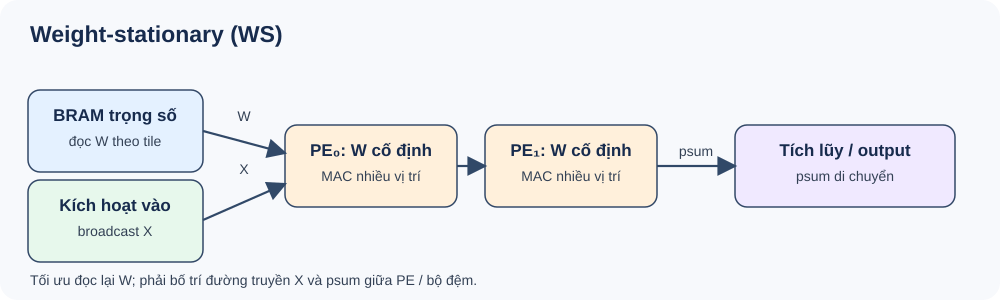
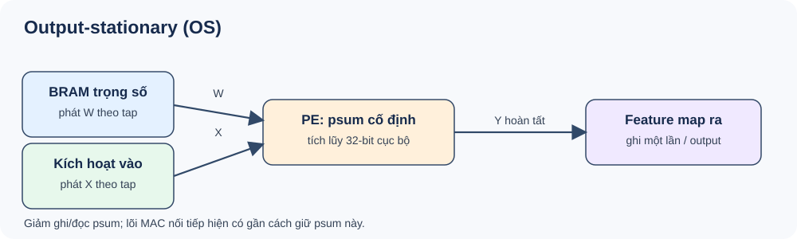
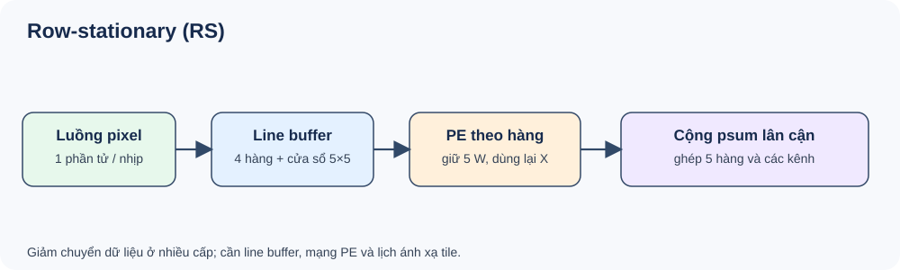
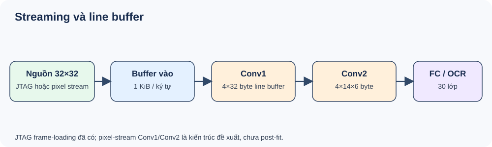
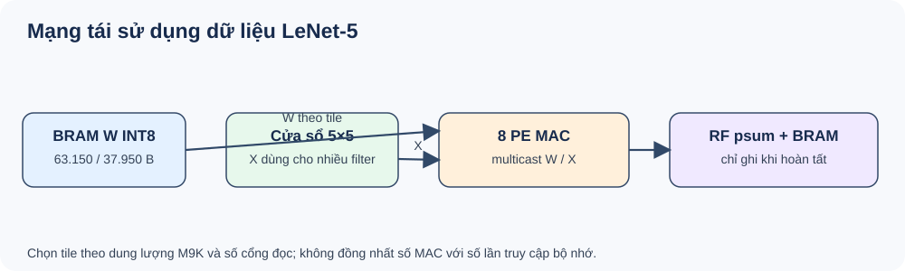

# Đánh giá LeNet-5 OCR biển ô tô 1 hàng/2 hàng: dense, structured pruning và dataflow

Ngày thực nghiệm: 01/10/2026. Đích phần cứng: DE10-Lite, MAX 10 `10M50DAF484C7G`, xung giả định 50 MHz. Tài liệu này tách **số đo thật**, **kết quả sau tổng hợp Quartus**, **kiểm chứng chức năng bằng phần mềm** và **ước lượng lý thuyết**. Không được coi chúng là cùng một loại số liệu.

## 1. Kết luận trước

Trên cùng tập kiểm tra ảnh thật đã tách sẵn ký tự, LeNet-5 dense đạt **3.083/3.200 ký tự (96,34%)** và **336/400 biển đúng toàn bộ (84,0%)**. Tỉa có cấu trúc 50% **filter đầu ra Conv2** (16 → 8, đồng thời thu nhỏ đầu vào FC1) đạt **3.079/3.200 (96,22%)** và **334/400 (83,5%)**. Mức giảm là 0,125 điểm phần trăm ở ký tự và 0,5 điểm phần trăm ở toàn biển; đây là các sai khác nhỏ trên một lần chia dữ liệu, **chưa chứng minh hai mô hình có độ chính xác tương đương trên mọi tập**.

Pruning làm giảm **34,43% MAC**, **39,90% trọng số**, **35,97% bit bộ nhớ nội bộ sau fitting**; số logic element chỉ giảm **0,89%** vì bộ điều khiển, JTAG và datapath MAC không nhỏ đi tương ứng. Kiểm tra CPU batch 8 ký tự cải thiện p50 từ **0,29525 xuống 0,28240 ms** (1,046×), không phải tăng tốc 1,5× trên CPU. Ước lượng 1,5× chỉ hợp lệ cho lõi tính toán lý tưởng hoặc lịch MAC nối tiếp cũ, không bao gồm truyền ảnh.

Đánh giá gần end-to-end hơn trên **200 ảnh thật, từ bounding box biển có sẵn** tới chuỗi OCR chỉ đạt **110/200 (55,0%) dense** và **109/200 (54,5%) pruned**. Chưa có detector tự tìm biển trên toàn khung hình, chưa có camera realtime và chưa đo checkpoint mới trên kit. Do đó **chưa đạt mục tiêu 95–99% toàn hệ thống**.

## 2. Dữ liệu, chia tập và quy trình train

- Bộ mới ở `data/car_frontal_synthetic_2x1000_v1/`: đúng **1.000 biển ô tô 1 hàng và 1.000 biển ô tô 2 hàng**, ảnh PNG frontal được *dựng lại từ nhãn ảnh cũ*; không phải 2.000 ảnh chụp thực tế. Manifest ghi `source_image`, `label`, loại biển, SHA-256. Cả hai bố cục trong thí nghiệm này có **8 ký tự chữ/số**; dấu gạch/chấm chỉ là định dạng, không là lớp OCR. Tách ký tự trên ảnh dựng thành công 2.000/2.000, theo cấu trúc chữ in của chính bộ sinh.
- Chia theo **chuỗi biển khác nhau**: synthetic 1.600 train, 200 validation, 200 test; cân bằng 800/100/100 mỗi bố cục. Pretrain dense 4 epoch trên synthetic; sau đó lấy top-8 kênh Conv2 theo chuẩn L1 để tạo mô hình pruned thực sự nhỏ hơn, train tiếp tới epoch 12. Giai đoạn này cả hai đạt 200/200 biển test synthetic, nhưng **0/200 biển ảnh thật** ở phép thử ảnh gốc có bbox. Đây là bằng chứng domain gap, không phải thành công end-to-end.
- Để giảm domain gap, tiếp tục từ **cùng checkpoint synthetic dense**. Dense giữ 16 kênh Conv2; pruned giữ 8 kênh, cập nhật cả Conv1 khi fine-tune. Mỗi nhánh học 12 epoch trên cùng thứ tự batch và augmentation của **1.600 synthetic + 2.000 biển ảnh thật train(1) đã chuẩn bị**, batch 256, AdamW, learning rate `3e-4`, weight decay `1e-5`, cross-entropy. 400 ảnh thật validation (200/kiểu) chọn checkpoint theo accuracy ký tự; cả hai tốt nhất ở epoch 12, 97,3125% validation. Không sử dụng distillation loss trong lần so sánh này.
- Test độc lập: 400 biển thật **đã tách sẵn 8 crop 32×32** (200/kiểu) và 200 ảnh thật gốc có annotation bbox (100/kiểu). Số nhãn giao nhau giữa train/val/test = **0**. Dữ liệu gốc `train(1)` chứa nhiễu, góc, font và blur không giống ảnh dựng; test chuẩn bị dùng crop được tạo với sự hỗ trợ của **số ký tự nhãn**, nên không được gọi là hệ thống tự động.
- Thời gian train phần fine-tune của cả hai nhánh cộng chung khoảng **40,65 giây** trước đánh giá trên i5-12500H/PyTorch CPU 4 threads. Tổng thời gian vòng train từng nhánh trong history: dense **18,61 s**, pruned **16,41 s**; process RSS khi lập báo cáo khoảng **849 MB** cho dữ liệu và cả hai mô hình, không phải RAM riêng của mỗi mạng. Seed `20261002`; SHA-256 checkpoint và manifest ở [mixed_metrics.json](results/mixed_metrics.json). [History từng epoch](results/history.csv) có loss, accuracy, thời gian train/validation; [synthetic-only metrics](results/synthetic_only_metrics.json) cho giai đoạn đầu.

## 3. Kiến trúc, trọng số, phép tính

LeNet-5 nhận 1×32×32 xám, dùng Conv1 `1→6, 5×5` → tanh → average pool → Conv2 `6→16` hoặc `6→8, 5×5` → tanh → average pool → FC `400/200→120→84→30`. 30 lớp gồm `0–9` và 20 chữ cái cho phép. Số MAC của Conv là `H_out × W_out × C_in × C_out × K²`; FC là `N_in × N_out`. Pooling, tanh, bias, truyền bộ nhớ và điều khiển **không nằm trong MAC**.

| Lớp | Dense: weight | Pruned: weight | Dense: MAC/ký tự | Pruned: MAC/ký tự |
|---|---:|---:|---:|---:|
| Conv1 | 150 | 150 | 117.600 | 117.600 |
| Conv2 | 2.400 | 1.200 | 240.000 | 120.000 |
| FC1 | 48.000 | 24.000 | 48.000 | 24.000 |
| FC2 | 10.080 | 10.080 | 10.080 | 10.080 |
| FC3 | 2.520 | 2.520 | 2.520 | 2.520 |
| **Tổng** | **63.150** | **37.950** | **418.200** | **274.200** |

Bias tương ứng **256/248**; tổng tham số **63.406/38.198**. Lưu FP32 thô cần **253.624/152.792 byte**; trọng số INT8 cộng bias INT32 cần **64.174/38.942 byte**. Một biển 8 ký tự là **3.345.600/2.193.600 MAC**, bất kể ký tự xếp 1 hay 2 hàng; phần chi phí khác nhau nằm ở phát hiện hàng, chỉnh phối cảnh và tách ký tự. `50% pruning` chỉ nói đến filter Conv2, **không** có nghĩa toàn mô hình giảm 50% MAC.

Phân bố tensor đã được ghi riêng cho từng lớp: min/max, trung bình, độ lệch chuẩn, phân vị 1/99, tỉ lệ weight bằng 0 và activation của **8 glyph ảnh thật giữ ngoài train** tại [tensor_profile.json](results/tensor_profile.json). FP32 weight của cả hai mạng không có phần tử bằng 0; đây là **cắt hẳn filter**, không phải zero-mask. Sau lượng tử hóa, weight INT8 dense nằm trong **−117…117**, pruned trong **−121…114**, không phần tử nào bão hòa ở ±127; tỉ lệ đúng bằng 0 do lượng tử hóa lần lượt **1,416%/1,236%**. Phân bố activation trên 8 glyph chỉ mang tính kiểm tra biên nhỏ, **chưa đủ** chọn bitwidth an toàn cho mọi ảnh.

## 4. Độ chính xác và sai số

| Đánh giá | Dense | Pruned 50% Conv2 | Ý nghĩa |
|---|---:|---:|---|
| Ký tự, 400 biển thật đã tách crop | 3.083/3.200 = **96,34%** | 3.079/3.200 = **96,22%** | OCR trên crop, có hỗ trợ số ký tự khi chuẩn bị |
| Biển 1 hàng, đúng toàn bộ | 179/200 = **89,5%** | 177/200 = **88,5%** | Cùng test identities |
| Biển 2 hàng, đúng toàn bộ | 157/200 = **78,5%** | 157/200 = **78,5%** | Cùng test identities |
| Cả 400 biển đã tách crop | 336/400 = **84,0%** | 334/400 = **83,5%** | Exact match 8/8 |
| Ảnh thật có bbox: 1 hàng | 70/100 = **70%** | 69/100 = **69%** | Perspective → row/character split → OCR |
| Ảnh thật có bbox: 2 hàng | 40/100 = **40%** | 40/100 = **40%** | Cùng ảnh và bbox |
| Ảnh thật có bbox: tổng | 110/200 = **55,0%** | 109/200 = **54,5%** | **Chưa** bao gồm tự tìm biển trong toàn ảnh |
| Character error rate (edit distance / 1.600 ký tự nguồn) | 348/1.600 = **21,75%** | 348/1.600 = **21,75%** | Bao gồm bỏ sót/thừa ký tự |

Sai số trên test crop: dense **117/3.200 ký tự (3,656%)**, **64/400 biển (16%)**; pruned **121/3.200 (3,781%)**, **66/400 (16,5%)**. Khoảng tin cậy Wilson 95% mô tả mức bất định lấy mẫu: exact-plate crop dense **80,09–87,27%**, pruned **79,55–86,82%**; ảnh thật có bbox dense **48,08–61,74%**, pruned **47,58–61,25%**. Đây không thay thế cho test độc lập khác nguồn/camera.

Trên 200 ảnh thật có bbox, **32** ảnh lỗi tách hoặc phân hàng; **46** ảnh tách được nhưng số ký tự sai; **122** ảnh còn lại có đúng 8 ký tự. Trong 122 ảnh đó, OCR dense đúng trọn vẹn **110**, pruned **109**. Tỉ lệ **954/976 = 97,75%** ký tự chỉ tính trên 122 ảnh đã qua bộ lọc, nên là **selection-biased**: không được trình bày như độ chính xác ký tự end-to-end. Trung vị confidence softmax của crop được nhận là khoảng **0,991/0,990**, nhưng confidence cao không giải quyết các ảnh bị tách sai; chưa hiệu chuẩn confidence theo ECE/Brier.

### Theo từng ký tự trên 400 biển crop thật

| Ký tự | Số mẫu | Dense đúng | Pruned đúng | Ký tự | Số mẫu | Dense đúng | Pruned đúng |
|---|---:|---:|---:|---|---:|---:|---:|
| 0 | 294 | 290 | 289 | 8 | 144 | 138 | 138 |
| 1 | 258 | 248 | 249 | 9 | 195 | 191 | 191 |
| 2 | 258 | 252 | 252 | A | 244 | 234 | 233 |
| 3 | 575 | 564 | 563 | B | 22 | 16 | 18 |
| 4 | 261 | 252 | 251 | C | 118 | 113 | 112 |
| 5 | 167 | 159 | 159 | D | 9 | 1 | 1 |
| 6 | 478 | 459 | 456 | E | 5 | 3 | 3 |
| 7 | 170 | 163 | 164 | F | 2 | 0 | 0 |

Các lớp `G,H,K,L,M,N,P,S,T,U,V,X,Y,Z` có **0 mẫu test này**, không thể báo accuracy riêng. `D→0` xảy ra 7 lần; `3→6`, `5→6`, `6→C`, `4→A` cũng nổi bật. Tập đang rất lệch về `3` (575) và `6` (478), trong khi `D/E/F` quá ít; macro accuracy và kiểm thử theo lớp hiếm cần thêm dữ liệu. Xem [accuracy đủ 30 lớp](results/per_character_accuracy.csv), [ma trận nhầm lẫn dense](results/dense_real_presegmented_confusion.csv), [ma trận pruned](results/pruned_real_presegmented_confusion.csv) và [các cặp nhầm lẫn](results/confusion_pairs.csv). Ma trận ảnh gốc chỉ tính cho 122 ảnh đã căn đúng số ký tự: [dense](results/dense_real_external_confusion.csv), [pruned](results/pruned_real_external_confusion.csv).

### INT8 tham chiếu

Xuất trọng số INT8/bias INT32 của **checkpoint mới** và chạy fixed-point reference trên đúng 400 biển crop: dense **336/400** exact, **3.083/3.200** ký tự; pruned **334/400**, **3.080/3.200**. FP32/INT8 cùng dự đoán **3.198/3.200** ký tự dense và **3.197/3.200** pruned. Có thay đổi lẻ tẻ dù exact tổng không đổi. Đây là **mô phỏng số học của exporter**, chưa phải độ chính xác FPGA trên kit. [Số liệu INT8 và shift từng lớp](results/int8_real_test.json).

## 5. Kỹ thuật dataflow: điều gì đã kiểm tra, điều gì chưa

Stationary là **cách sắp lịch và di chuyển tensor trong accelerator**, không phải hàm loss hay phương pháp train. Giữ cùng trọng số, cùng số MAC và cùng độ chính xác toán học; khi lượng tử hóa/làm tròn khác thứ tự, dự đoán có thể lệch. Tham khảo [Eyeriss: row-stationary dataflow](https://www.cs.cmu.edu/~18742/papers/Chen2016.pdf) và [MIT tutorial về dataflow/energy](https://eems.mit.edu/wp-content/uploads/2017/11/2017_pieee_dnn.pdf). Việc cắt filter có cấu trúc và giảm chi phí tính thực xem [Li et al., Pruning Filters for Efficient ConvNets](https://arxiv.org/abs/1608.08710).

### Weight-stationary (WS)



Giữ weight ở PE nhiều chu kỳ, quét các vị trí đầu ra; có lợi khi filter được dùng lại nhiều lần, nhưng phải vận chuyển activation và psum. Conv1: 150 weight phục vụ 117.600 MAC, tức mỗi weight được dùng **784 lần** nếu xét toàn layer; Conv2: mỗi weight được dùng **100 lần**. Con số đó là tiềm năng tái sử dụng logic, **không** phải số truy cập BRAM đã đo. Tối thiểu một cụm 8 PE cần 8 byte thanh ghi weight INT8, chưa gồm psum/buffer/định tuyến. Mã tham chiếu chạy đúng về chức năng; **chưa có RTL WS riêng hoặc post-fit WS**.

### Output-stationary (OS)



Giữ một hoặc vài psum 32-bit tại PE cho đến khi một output hoàn tất, giảm đọc/ghi psum; weight và activation đi tới PE. Cụm giả định 8 PE cần ít nhất **32 byte** thanh ghi psum. RTL `OcrBenchCore.sv` hiện **gần kiểu OS**: một tích lũy `acc` và một MAC nối tiếp; số multiplier sau fit là **1**, không phải 8 PE. Hai biến thể dense/pruned *frame streaming* của RTL đó đã compile Quartus. **Không** thể suy từ kết quả này thành performance của OS 8 PE.

### Row-stationary (RS)



Giữ một hàng kernel, trượt trên hàng input qua line buffer và trao đổi psum giữa PE; RS tối ưu kết hợp reuse của weight, activation, psum qua nhiều cấp. Với kernel 5×5, giả định 8 PE, thanh ghi tối thiểu 5×8 = **40 byte weight**, chưa gồm buffer và mạng chuyển dữ liệu. Cài đặt tham chiếu CPU đã kiểm tra output; **chưa có mảng PE RS tổng hợp FPGA**. Không có số liệu post-fit LE/Fmax của RS ở đây.

**Kiểm tra tính đúng ở mức thuật toán:** thay Conv1/Conv2 bằng ba thứ tự vòng lặp WS/OS/RS trên 4 glyph ảnh thật đã giữ ngoài train, cho **4/4 argmax giống PyTorch** ở mỗi mô hình/mỗi thứ tự; sai khác lớn nhất Conv2 dưới `2,7×10⁻⁶` FP32. Đây là kiểm tra nhỏ về đẳng trị hàm, **không** là benchmark latency. [Kết quả kiểm tra](results/dataflow_functional.json) và mã [verify_dataflows.py](verify_dataflows.py).

## 6. Streaming và mạng tái sử dụng dữ liệu



Kịch bản **đã compile**: PC gửi từng ảnh ký tự `32×32` qua JTAG thành **64 gói × 16 byte**, FPGA nạp đủ **1.024 byte** rồi lõi MAC mới tính. Đây là **frame-loading streaming ở cổng vào**, chưa phải Conv1→Conv2 pixel-stream/pipeline. Cận dưới truyền lý tưởng 1 byte/clock ở 50 MHz là `1.024 / 50e6 = 20,48 µs` mỗi ký tự; USB-Blaster/JTAG thực tế không đạt cận này và chưa đo lại với checkpoint mới. Số liệu benchmark kit trước của cùng kiến trúc cho thấy truyền JTAG có thể lấn át compute; không lấy đó làm tốc độ kit hiện tại.

Để **thiết kế** pixel-stream thật: Conv1 cần line buffer `4×32 = 128 B` và cửa sổ `5×5 = 25 B`; Conv2 nhận 6 kênh `14×14`, cần `4×14×6 = 336 B` cộng cửa sổ `5×5×6 = 150 B`. Bộ đệm đỉnh của hai lớp, lịch pooling, độ rộng psum, FIFO, cổng BRAM và backpressure còn phải triển khai/đo bằng RTL. So với lưu cả feature map Conv1 **4.704 B**, pool1 **1.176 B**, Conv2 **1.600/800 B**, pool2 **400/200 B**, line buffer có tiềm năng giảm lưu trữ trung gian nhưng không tự động đảm bảo throughput. Tư liệu first-party về nguyên lý line buffer: [Microchip FPGA-HLS Sobel tutorial](https://github.com/MicrochipTech/fpga-hls-examples/blob/main/sobel_tutorial/trainingdoc.md).



Mạng đề xuất: BRAM chứa W INT8 → multicast W theo tile tới PE, cửa sổ X chung cho nhiều filter, RF giữ psum, chỉ ghi output khi xong. Conv1 có tối đa 1.024 pixel input khác nhau nhưng 117.600 lượt dùng input theo MAC, Conv2 có 1.176 phần tử input khác nhau nhưng 240.000/120.000 lượt dùng. Đây là **cận tiềm năng** khi reuse hoàn hảo, không phải lượng đọc BRAM/DDR quan sát được. Hiện chưa có RTL arbiter/multicast/FIFO để đo traffic hoặc chứng minh timing của mạng này. Streaming, WS/OS/RS và pruning là **ba trục thiết kế khác nhau**; có thể kết hợp, nhưng không được cộng các tỉ lệ tăng tốc lý thuyết một cách máy móc.

## 7. Tài nguyên DE10-Lite và độ trễ: số đo nào có thể dùng

Quartus Prime Lite 25.1std compile hai project `rtl_eval/dense_stream` và `rtl_eval/pruned_stream` với **weight ROM từ checkpoint hỗn hợp mới**. Cả hai fitter thành công trên device 10M50DAF484C7G; số dưới là **post-fit**, không phải đo mạch thực.

| Chỉ số | Dense stream | Pruned stream | Thay đổi |
|---|---:|---:|---:|
| Logic elements | 2.356 / 49.760 | 2.335 / 49.760 | −21 (−0,89%) |
| Dedicated registers | 1.066 | 1.066 | 0 |
| On-chip memory bits | 560.432 / 1.677.312 | 358.832 / 1.677.312 | −201.600 (−35,97%) |
| Embedded multiplier 9-bit elements | 1 / 288 | 1 / 288 | 0 |
| Fmax slow 85°C, chỉ các path được phân tích | 64,76 MHz | 68,59 MHz | +5,91%, **không phải tốc độ xử lý end-to-end** |
| Setup slack ở 50 MHz, first 85°C report | +4,558 ns | +5,421 ns | Cần sign-off đủ constraint |

**Cảnh báo:** Timing Analyzer ghi *“Design is not fully constrained for setup/hold requirements”*; Fmax chưa đủ để cam kết timing trên kit. Không có JTAG local khả dụng khi kiểm tra (`jtagconfig` chỉ báo remote server không kết nối), nên **không nạp/chạy checkpoint mới trên DE10-Lite**. Xem [số tổng hợp post-fit](results/quartus_postfit.json), file Quartus cục bộ `rtl_eval/*_stream/output_files/` (không đưa output build lên Git).

| Loại latency | Dense | Pruned | Giới hạn phép so sánh |
|---|---:|---:|---|
| CPU forward 1 glyph p50, 1.000 lần xen kẽ ngẫu nhiên | 0,17270 ms | 0,17045 ms | PyTorch/i5 CPU, khác FPGA |
| CPU forward batch 8 glyph p50 | 0,29525 ms | 0,28240 ms | Chỉ OCR đã cắt, không gồm preprocess |
| Cận dưới 8 PE × 1 MAC/PE/clock, 50 MHz, 1 glyph | 52.275 chu kỳ = 1,0455 ms | 34.275 = 0,6855 ms | **Chưa có RTL 8 PE**, bỏ qua mọi stall/pool/tanh/I/O |
| Lịch MAC nối tiếp của lõi cũ, 1 glyph | 870.198 chu kỳ ≈ 17,404 ms | 577.998 ≈ 11,560 ms | Số chu kỳ từ lần đo RTL trước với cùng shape/FSM, **không đo lại** checkpoint này |
| Lịch MAC nối tiếp cũ, 8 glyph | ≈ 139,23 ms | ≈ 92,48 ms | Thuần compute ở 50 MHz, chưa gồm 8 lần JTAG |

Độ trễ CPU batch 8 tăng tốc khoảng **1,046×**, trong khi MAC lý tưởng giảm cho tỉ lệ **1,525×**. Nguyên nhân: overhead PyTorch/dispatch, kích thước batch nhỏ, Conv1 không đổi, bộ nhớ và lịch thực thi; pruning giảm công việc nhưng không đảm bảo tăng tốc tỷ lệ thuận. Hai số median của toàn chuỗi ảnh gốc đo nối tiếp trong lần đánh giá ban đầu bị lệch do warm-up/cache/thứ tự thử nghiệm nên **không dùng để tuyên bố speedup hệ thống**. Muốn đo ổn định cần trộn thứ tự model/ảnh, warm-up cả hai, đo preprocessing/transfer/inference riêng, lặp nhiều lần và báo phân vị. [Dữ liệu benchmark CPU](results/cpu_interleaved.json); [lịch đo RTL cũ](../de10_lite_ocr_compare/comparison_full.json).

## 8. Đánh giá toàn hệ thống và việc còn thiếu

Chuỗi đã kiểm thử bằng phần mềm là **ảnh thật → bbox có sẵn từ tên/annotation → chỉnh phối cảnh → phân loại 1/2 hàng & sắp ký tự → crop 32×32 → LeNet-5 → chuỗi**. Nó không bao gồm tự tìm biển trong khung camera, không chạy preprocessing trên FPGA và không xác nhận FPS. Độ chính xác OCR cao ở ảnh cắt sẵn (96,2–96,3% ký tự) **không chuyển thành 96% toàn hệ thống** vì 78/200 ảnh lỗi hàng hoặc số ký tự. Số `Fmax` và giảm MAC cũng **không chứng minh hệ thống realtime** khi truyền JTAG là nút thắt.

Ưu tiên tiếp theo: (1) chuẩn hóa nhãn/crop và bổ sung nhiều mẫu thật cho `B,D,E,F` cùng 14 lớp chưa test; (2) sửa detector, perspective và row/character split trên 200 lỗi test mà không nhìn nhãn test để tối ưu; (3) lập bộ test độc lập mới có cả full-frame ảnh/video, góc nghiêng và blur; (4) hiện thực/compile ba PE-array WS/OS/RS riêng, đo *cùng* số PE, cùng bitwidth, cùng clock/constraint, lượng BRAM traffic và năng lượng nếu có thiết bị; (5) thay nạp JTAG từng frame bằng giao tiếp tốc độ phù hợp và đo kit thật sau khi Quartus nhận USB-Blaster.

## 9. Tái lập và kiểm chứng tại VS Code

Mở thư mục `D:\TOTNGHIEP\license_plate_ai` trong VS Code, chọn interpreter `.venv\Scripts\python.exe`. Ở Terminal tích hợp, chạy các lệnh dưới đây **theo thứ tự**, chọn output path mới khi train lại vì script cố ý không ghi đè checkpoint/report hiện có:

```powershell
.\.venv\Scripts\python.exe train_synthetic_car_compare.py --audit-only
.\.venv\Scripts\python.exe train_synthetic_car_compare.py --output artifacts/synthetic_car_repeat
.\.venv\Scripts\python.exe finetune_mixed_car_compare.py --pretrained artifacts/synthetic_car_repeat/dense.pt --output artifacts/mixed_car_repeat
.\.venv\Scripts\python.exe hardware/dataflow_study/analyze_dataflows.py --output artifacts/mixed_car_repeat/dataflow_bounds.json
.\.venv\Scripts\python.exe hardware/dataflow_study/verify_dataflows.py --models artifacts/mixed_car_repeat --output artifacts/mixed_car_repeat/dataflow_functional.json
.\.venv\Scripts\python.exe hardware/dataflow_study/benchmark_forward.py --models artifacts/mixed_car_repeat --output artifacts/mixed_car_repeat/cpu_interleaved.json
.\.venv\Scripts\python.exe hardware/dataflow_study/evaluate_int8.py --models artifacts/mixed_car_repeat --output artifacts/mixed_car_repeat/int8_real_test.json
.\.venv\Scripts\python.exe hardware/dataflow_study/profile_tensors.py --models artifacts/mixed_car_repeat --output artifacts/mixed_car_repeat/tensor_profile.json
```

Khi chạy lại, `finetune_mixed_car_compare.py` vẫn đọc 2.000 ảnh synthetic từ đường mặc định; muốn đổi data dùng `--data`. Mã ghi checkpoint/metrics bên `artifacts/` và ảnh nguồn ở `data/`, đều **không** đưa lên GitHub. Để đánh giá lại fitter, xuất ROM theo README của `hardware/de10_lite_ocr_compare`, mở các project `.qpf` ở `rtl_eval/`, thay ROM và compile lại; không diễn giải post-fit cũ là số đo của checkpoint mới.

Số liệu tổng hợp được công bố không chứa ảnh/nhãn từng biển: [results_summary.json](results/results_summary.json), [toàn bộ 30×30 confusion](results/dense_real_presegmented_confusion.csv) và [công thức/cận dataflow](results/dataflow_bounds.json). Hai checkpoint **cuối cùng** để chạy thử có ở [dense.pt](../../artifacts/mixed_car_dense_pruned_20261001/dense.pt) và [pruned.pt](../../artifacts/mixed_car_dense_pruned_20261001/pruned.pt); SHA-256 nằm trong summary để đối chiếu. Ảnh nguồn, manifest từng biển, ROM đã lượng tử hóa và checkpoint giai đoạn synthetic-only vẫn lưu cục bộ, không đưa lên GitHub.
